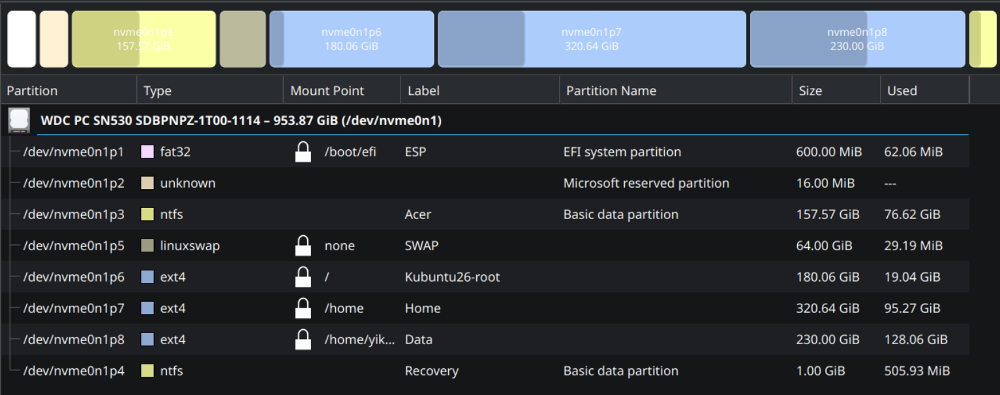

# Kubuntu 26.04 Installation and Desktop Setup

#### Lastest Update: **`2026-06-03`**

> [!NOTE]  
> This guide is mainly for installing `Kubuntu 26.04` on **Acer Nitro 5 AN515-45** (or similar models). 


> [!WARNING]  
> Once you have successfully installing Kubuntu, **`avoid blindly updating everything at once`** as it may break the system or cause minor issues. In particular, be cautious with full system upgrades such as `sudo apt upgrade` or `sudo apt full-upgrade`. A safer approach is to update them in batches and only update what is necessary. This is not only specific to Linux-T2, but generally applies to any Linux distribution. 


<i><p align="left"><b>Disclaimer</b>: I have made every effort to ensure the accuracy of this document, but errors may still be present, and the system may break with a wrong code  
Feel free to leave any comments/thoughts. Thank you!<p></i>  

---
## System 

<div align="left">
  <div style="margin: 2px 0;">
    
    <span style="vertical-align: middle;">Ubuntu 26.04 LTS</span>
  </div>
  <div style="margin: 2px 0;">
    Codename: 
    <span style="vertical-align: middle;"></span>
  </div>
</div>  

Kernel Version: **7.0.0-22-generic (64-bit)**  
KDE Plasma Version: 6.6.4  
KDE Frameworks Version: 6.24.0  
Qt Version: 6.10.2  
Graphics Platform: Wayland  
Processors: 16 × AMD Ryzen 7 5800H with Radeon Graphics    
Memory: 16 GiB of RAM (15.0 GiB usable)  
System: Acer Nitro AN515-45  

---
## Content

* [1. Installation](#installation)  
* [2. System Setting](#system-setting)  
* [3. Dolphin](#dolphin)  
* [4. Konsole](#konsole)  
* [5. Kate](#kate)  

---
## Installation 

- The installation steps are similar to those described in [Kubuntu-T2 installation](/Kubuntu-T2_Setup/01_Kubuntu-T2_Install.md). The only differece is the MBP2019 was pre-installed with macOS while the Acer Nitro 5 came with Windows system.

- Windows's default UEFI has only 100 MB (mac system usually has 300 MB). For a duel boot system, it is better to increase to 300-500 MB. 


### Pre-Installation Requirement:
  1. Kubuntu 26.04 LTS Live USB can be download [here](https://kubuntu.org/).  
  2. Use [Rufus](https://rufus.ie/en/) to create a Live USB in Windows. You can refer the instruction [here](https://documentation.ubuntu.com/desktop/en/latest/tutorial/install-ubuntu-desktop/#create-a-bootable-usb-stick) and just replace the `Ubuntu iso` to `Kubuntu iso`.

  ⚠️ I highly recommand verify the SHA256sum (hash) of the ISO file first before installation.

---
### Step 
  1. Boot into Windows and shrink Windows partition from inside Windows (Use `Disk Management`) to create the free space appears AFTER C. For my **1 TB storage, I only preserve 160 GB** for Windows as most of my data will be in Linux for my work.  
  
  2. Press **`F2`** to enter BIOS to change Acer's BIOS setting
    - Secure Boot: `Enable`
    - Boot Menu: `Enbale`    
  
  ⚠️ For Acer laptops, you need to enable Secure Boot first and set a security PIN to access the boot menu for booting from a USB drive.


  3. Press `F10` or `F12` to Boot into a live Linux USB and use **`GParted`** to Move partitions. Typical operation:
  
      `[EFI-100MB]` | `[MSR-16MB]` | `[Windows]`

      Need to become:

      **`[ESP-600MB]`** | **`[MSR016MB]`** | `[Windows-160GB]` | **`[Rest for Linux ~794GB]`**
    
      👉 You can use any Linux Distro that comes with GParted. If you are using the Kubuntu Live USB, you can install `GParted` in terminal when booting into the live USB. 

      ```bash
      sudo apt update
      sudo apt install GParted
      ```

  4. **Enlarge ESP** by moving the each parition one by one and test in between to ensure you can still boot into the Windows.  

      (1) Move Windows right     
      ⚠️ I prefer **move** here because shrinking mean we remove something at the front.  

      (2) Move MSR right  
        
      (3) Enlarge ESP   

  ⚠️ ⚠️ Move Paritition could cause data loss, make sure you back all the important data. Do not delete any partition.  

  5. Once the ESP is expanded and you confirm that Windows still boots correctly, you can use a live USB to partition the Linux drive. You can use KDE Partition Manager or GParted (you may need to install it, since the live USB environment is not persistent).  
  
  6. Linux Disk Partition: Using a four-partition layout (swap, root, home, data) to facilitate data backup  
    - Total space: 1 TB
    - Linux swap: 64 GB (65,536 MB)
    - Root (/): 180 GB (184,320 MB)
    - Home (/home): 320 GB (327,680 MB)
    - Leave the remaining space as unallocated for setting up a **`data`** partition later.  
    
  7. Final Partition Map:  
   


<sub>[↥ back to top](#content)&emsp;|&emsp;[Return Main Page 🏠](/README.md) </sub>   

---
## System Setting

### 1. Appearance
- Global Theme: Breeze Dark
    - Application Style: [Breeze] (left as it)
    - Plasma Style:
        - [Breeze]: slightly more colorful
        - Oxygen: more black/white
    - Colors: [Breeze Dark] (left as it)
    - Windows Decorations: Breeze (or Oxygen) > Shadows > Medium, 55% > `#55ff00`.
    - Icon: Breeze Dark (left as it)
    - Splash Screen: MX-Dark

---
### 2. Quick Setting
  - Clicking files or folders: `[Selects them]`

---      
### 3. Windows Management
  **Note**:   
  1. If left empty, it means that I left as [default values].
  2. Belows are based on MX_KDE. Some options migh be not present in the newer Kubuntu 26/KDE 6

  - Windows Behavior
      - Focus: `Focus follows mouse`
      - Delay: `500 ms`
      - Focus stealing prevetion: `Low`
      
  - Decktop Effects
      - Background Contrast
      - [Screen Edge]
        - Activation delay: `150 ms`
        - Edge barrier: `150 px`
      - [Sliding Popups]
      - [Magic Lamp]
      - Dialog Parent: `Unchecked`/`[Checked]` --> It really depends; for an older system I will change it to uncheck.
      - Dim Inactive: set `[15-25]`
      - [Window Aperture]
      - Fade Desktop or `[Slide]`
      - Window Open/Close Animation: `[Scale]`
      - Screen Locking: After `[5 minute]`
      - Virtual Desktops: `[1 Row]`
    

  - Windows Rules: If you have a previous windows rule, you can import here. 


### 4. Shortcut
  **Note: Meta = Super Key = Win Key/Command Key**
  
  - Konsole: [**Ctrl + Alt(Opt) + T**]
  - Spectacle: [**Meta + Shift + S**]
  - Switch One Desktop to the Lefe: [**Ctrl + Meta + Left**]/[**Ctrl + Alt + Left**]
  - Switch One Desktop to the Right: [**Ctrl + Meta + Right**]/[**Ctrl + Alt + Right**]
  - Toggle Windows - **All Desktop**: [**Meta + Tab**]
  - Window One Destop to the Left (Move the window to the Left Desktop): [**Meta + Left**]/**[Alt(or Opt) + Left]**
  - Window One Destop to the Right (Move the window to the Right Desktop): [**Meta + Right**]/[**Alt (or Opt) + Right**]
  - Lock Screen: **Meta + L**


### 5. Startup and Shutdown
  - Login Screen (SDDM)


### 6. Notification:
  - Hide after: `[3 seconds]`
  - Uncheck: Keep popup open during progress
  - Check/Uncheck: Notification Badge

### 7. Display and Monitor
- Night Color
    - Day:`[4700K]`
    - NIght: `[3500K - 3700K]`
    - Begin at `[18:00]`
    - End at `[10:00]`


### 8. Input/Output 
  - Mouse & Touchpad > Screen Edges: [Activation delay] = `[125 ms]`
  - Sound > Configure Volumne Controls > Volume change step = `[2%]`

### 9. KDE Wallet
  - A secure, integrated password management system for the KDE Plasma desktop environment that stores sensitive information like WiFi password, app credentials
  
  - Only need if you want system to manage your password, or you have a previous wallet that you want to bring it over.
  
  
  - Import previous KDE Wallet: 
  
    1. Copy the old wallet files:

        ```bash
        ~/.local/share/kwalletd/kdewallet.kwl
        ~/.local/share/kwalletd/kdewallet.salt
        ```

    2. Copy them into the same location on your new system

    3. Unlock it with the old password
    
    4. Restart KWallet: Log out/log back in or run:  

        ```bash
        kwalletd6 &
        ```  

  - If the above solution does not work, try the follow steps:
    
    - Enable KWallet + PAM integration: Some distros might only have KWalletManager and KWallet backend, not PAM. To install it, run:
      
      ```bash
      apt search kwallet | grep pam # check if have pam
      cat /etc/pam.d/sddm # looking for pam_kwallet.so
      sudo apt install kwalletmanager pam-kwallet
      
      sudo apt install libpam-kwallet5 # confirm the version is compatiable
      ```
    - Hook PAM with the login manager: 

      ```bash
      sudo nano /etc/pam.d/lightdm

      # Add these lines, Ctrl + X, Save buffer: Y
      auth    optional    pam_kwallet5.so
      session optional    pam_kwallet5.so auto_start
      ```

**Note**: MX-25.1 already has pam integration, only need to copy`kdewallet.kwl` and `kdewallet.salt` over to the default kwalletd location


---
## Dolphin
  - The Kubuntu's download folder is default grouped by date (i feel not as easy to use):

    - **To Fix:** 

      1) Right-click on the top toolbar.
      2) Select Configure Toolbars....Search for "`Show in Groups`" in the left column.
      3) Move it to the right column and click Apply.
      4) Click the button on your toolbar to toggle it off.
      5) Ensure "Remember display style for each folder" is checked.


---
## Konsole 
- Settings
  - Configure Konsole (**Ctrl + Shift + ,** ) > Profle > Selected Profile > Edit
    - Appearance > Breeze > Save as **Breeze2** > Edit 
    - Modified the color you prefer
    - My Setup: Konsole Breeze Color Palette

  ####  Background & Foreground

  | Name | RGB | Hex |
  |--------|--------|--------|
  | Background | 35,38,39 | #232627 |
  | Background Faint | 49,54,59 | #31363B |
  | Background Intense | 0,0,0 | #000000 |
  | Foreground | 252,252,252 | #FCFCFC |
  | Foreground Faint | 239,240,241 | #EFF0F1 |
  | Foreground Intense | 255,170,0 | #FFAA00 |

  ---

  #### ANSI Colors (0–7)

  | Color | Normal | Faint | Intense |
  |---------|---------|---------|---------|
  | Black (0) | #232627 | #31363B | #7F8C8D |
  | Red (1) | #ED1515 | #783228 | #EB4632 |
  | Green (2) | #41C841 | #5AC878` | #3CDC3C |
  | Yellow (3) | #F67400 | #B65619 | #FDBC4B |
  | Blue (4) | #3296F0 | #1B668F | #3CAAF0 |
  | Magenta (5) | #F096D2 | #B170FC | #FF55FF |
  | Cyan (6) | #1EB4C8 | #1EB4C8 | #1EF0E6 |
  | White (7) | #FCFCFC | #63686D | #FFFFFF |

  ---

  #### Quick Reference

  | ANSI | Hex |
  |------|------|
  | Color0 (Black) | `#232627` |
  | Color1 (Red) | `#ED1515` |
  | Color2 (Green) | `#41C841` |
  | Color3 (Yellow) | `#F67400` |
  | Color4 (Blue) | `#3296F0` |
  | Color5 (Magenta) | `#F096D2` |
  | Color6 (Cyan) | `#1EB4C8` |
  | Color7 (White) | `#FCFCFC` |

  #### Bright Variants

  | ANSI | Hex |
  |------|------|
  | Bright Black | `#7F8C8D` |
  | Bright Red | `#EB4632` |
  | Bright Green | `#3CDC3C` |
  | Bright Yellow | `#FDBC4B` |
  | Bright Blue | `#3CAAF0` |
  | Bright Magenta | `#FF55FF` |
  | Bright Cyan | `#1EF0E6` |
  | Bright White | `#FFFFFF` |

- Scripts to run to evaluate the color 
  - Basic ANSI Color Test Script
    ```bash
    echo "=== Standard ANSI Colors (0–7) ==="
      for fg in {30..37}; do
          for bg in {40..47}; do
              echo -ne "\e[${fg};${bg}m FG:${fg} BG:${bg} \e[0m "
          done
          echo
      done

      echo -e "\n=== Bright ANSI Colors (90–97 / 100–107) ==="
      for fg in {90..97}; do
          for bg in {100..107}; do
              echo -ne "\e[${fg};${bg}m FG:${fg} BG:${bg} \e[0m "
          done
          echo
      done
    ```
  - Full 256-Color Test (Foreground)
    ```bash
    echo "=== 256-color ANSI palette ==="
    for i in {0..255}; do
        printf "\e[38;5;%sm%3s\e[0m " "$i" "$i"
        if (( (i + 1) % 16 == 0 )); then
            echo
        fi
    done
    ```
  - Style + Color Combo Test
    ```bash
    styles=(0 1 2 4 5 7)  # normal, bold, dim, underline, blink, reverse

    for style in "${styles[@]}"; do
        echo "Style $style"
        for color in {30..37}; do
            echo -ne "\e[${style};${color}m S:${style} C:${color} \e[0m "
        done
        echo -e "\n"
    done
    ```


---
## Kate  
**Note:** If you do not see KvAdapta or KvamtumAlt, install it with `sudo apt install qt-style-kvantum-themes`
- Settings  
    - Show Path in Title Bar
    - Windows Color Schema (I presonally like the followings):
        - Breeze Dark
        - **KvAdapta Dark**
        - KvFlatRed
        - KvamtumAlt
    - Editor Color Schema: **Monokai2**
    - Configure Kate
        - Color Themes > Default Theme > Monokai > Save as Monokai2.  
      **Note:** You always need to create the selected theme as a new theme copy.
        
---
## Reference 
1. [Kubuntu/Download](https://kubuntu.org/download/)

2. [Create a bootable Ubuntu USB](https://documentation.ubuntu.com/desktop/en/latest/tutorial/try-ubuntu-desktop/#create-a-bootable-usb-stick:~:text=a%20bootable%20USB-,stick,-%C2%B6/) 👉 Make sur you selct the proper system for your case.

3. [How to verify the SHA256](https://help.ubuntu.com/community/HowToSHA256SUM)